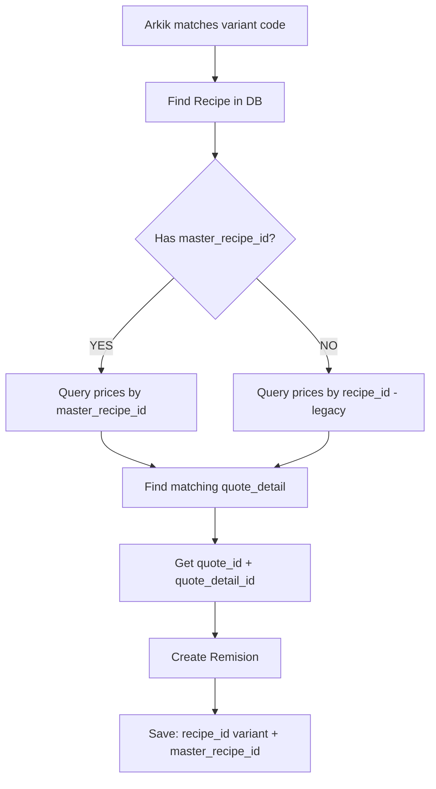

# Master Recipe Pricing - Arkik Flow Fix

## Problem Summary

The Arkik validation was failing for variant recipe `5-250-2-B-28-14-D-3-000` because it couldn't find pricing, even though the master recipe `5-250-2-B-28-14-D` had pricing configured.

### Root Cause

The system was only looking for prices on the **variant's recipe_id**, but in the new master-variant architecture, prices are stored on the **master_recipe_id** in `quote_details`.

### Database State (Verified)

**Master Recipe:**
- ID: `a4370019-6cda-49eb-8aa8-18fa73b21a5e`
- Code: `5-250-2-B-28-14-D`

**Variants:**
1. `5-250-2-B-28-14-D-2-000` (ID: 3309dac3-dad2-482c-b2a5-32d6d72581a3)
2. `5-250-2-B-28-14-D-3-000` (ID: 99af645c-71c9-4973-a952-0cf15c827a41) ← **This one was failing**

**Pricing Location:**
```sql
-- Quote: COT-2025-2269
-- Quote Detail ID: 34cd61a9-bfd9-4dde-b426-15ec587fd441
SELECT * FROM quote_details WHERE id = '34cd61a9-bfd9-4dde-b426-15ec587fd441';

Results:
- master_recipe_id: a4370019-6cda-49eb-8aa8-18fa73b21a5e  ✅
- recipe_id: NULL  (no specific variant)
- final_price: $2000.00
- Client: JUAN AGUIRRE
- Site: SILAO
```

## The Fix

### 1. Updated Data Model (`debugArkikValidator.ts`)

**DebugPricing Interface:**
```typescript
interface DebugPricing {
  // ... other fields
  source: 'client' | 'client_site' | 'plant' | 'quotes' | 'master';  // Added 'master'
}
```

### 2. Recipe Loading (Include master_recipe_id)

**Updated queries to include master relationship:**
```typescript
// loadAllRecipes
.select('id, recipe_code, arkik_long_code, arkik_short_code, master_recipe_id')

// loadAllProductPrices  
.select('recipe_id, master_recipe_id, client_id, construction_site, base_price, ...')

// loadAllQuotes
.select('... quote_details(id, recipe_id, master_recipe_id, final_price)')
```

### 3. Master-First Pricing Logic

**loadUnifiedPricing Method:**
```typescript
private async loadUnifiedPricing(
  recipeId: string, 
  masterRecipeId?: string | null  // NEW: Accept master_recipe_id
): Promise<DebugPricing[]>
```

**Flow:**
1. Check if variant has a master (`masterRecipeId`)
2. If YES → Query `product_prices` WHERE `master_recipe_id = master`
3. If NO → Fall back to old way WHERE `recipe_id = variant`

**Product Prices Query:**
```typescript
if (masterRecipeId) {
  priceQuery = priceQuery.eq('master_recipe_id', masterRecipeId);
} else {
  priceQuery = priceQuery.eq('recipe_id', recipeId);
}
```

**Quote Details Query:**
```typescript
// Filter quotes that match either by master_recipe_id OR recipe_id
const matchingQuotes = quotes.filter(quote => 
  quote.quote_details.some((detail: any) => {
    if (masterRecipeId && detail.master_recipe_id === masterRecipeId) return true;
    if (detail.recipe_id === recipeId) return true;
    return false;
  })
);
```

### 4. Batch Loading (Preload Performance)

**Master Price Propagation:**
```typescript
// Build masterToPrices map from quote_details with master_recipe_id
if (detail.master_recipe_id) {
  masterToPrices.set(detail.master_recipe_id, [...details]);
}

// Propagate to ALL variants of that master
recipesData.forEach(recipe => {
  if (recipe.master_recipe_id && masterToPrices.has(recipe.master_recipe_id)) {
    // Add master prices to this variant's pricing options
    pricingByRecipe.get(recipe.id).push({
      recipe_id: recipe.id,  // Use variant ID
      source: 'master',      // Mark as master pricing
      quote_detail_id: masterQuote.id,  // CRITICAL for order creation
      // ... rest of pricing data
    });
  }
});
```

### 5. Key Changes Summary

| Component | Change | Why |
|-----------|--------|-----|
| `DebugPricing` type | Added `'master'` source | Distinguish master vs variant pricing |
| `loadAllRecipes()` | Select `master_recipe_id` | Know which master a variant belongs to |
| `loadAllProductPrices()` | Select `master_recipe_id` | Support master-based prices |
| `loadAllQuotes()` | Select `master_recipe_id` in details | Support master-based quotes |
| `loadUnifiedPricing()` | Accept `masterRecipeId` param | Enable master-first lookup |
| Price query | Check master first, then variant | Dual-mode compatibility |
| Quote matching | Match by master OR recipe | Support both architectures |
| Batch loading | Propagate master prices to variants | Performance optimization |

## Workflow



## Testing

### Test Case: D-3 Variant (Previously Failing)

**Input:**
- Remision with product code: `5-250-2-B-28-14-D-3-000`
- Client: JUAN AGUIRRE
- Site: SILAO

**Expected Flow:**
1. ✅ Match variant `99af645c-71c9-4973-a952-0cf15c827a41`
2. ✅ Get `master_recipe_id = a4370019-6cda-49eb-8aa8-18fa73b21a5e`
3. ✅ Query `quote_details` WHERE `master_recipe_id = a4370019...`
4. ✅ Find quote detail `34cd61a9-bfd9-4dde-b426-15ec587fd441`
5. ✅ Price: $2000.00
6. ✅ Validate client/site match
7. ✅ Create remision with:
   - `recipe_id`: 99af645c... (D-3 variant)
   - `master_recipe_id`: a4370019... (master)
   - `quote_id`: 2f76826f...
   - Price: $2000.00

### Debug Logs to Look For

```
[DebugArkikValidator] Recipe 99af645c... has master a4370019... - will look up master prices
[DebugArkikValidator] Querying prices by master_recipe_id: a4370019-6cda-49eb-8aa8-18fa73b21a5e
[DebugArkikValidator] Found 1 quotes matching master
[DebugArkikValidator] ✅ Found master-based quote: JUAN AGUIRRE | SILAO | $2000.00 | Detail ID: 34cd61a9...
```

## Backward Compatibility

The fix maintains **dual-mode operation**:

1. **New way** (Master pricing): Queries by `master_recipe_id`
2. **Old way** (Variant pricing): Falls back to `recipe_id`

This ensures:
- ✅ New master-based quotes work
- ✅ Legacy variant-based quotes still work
- ✅ Migration can happen gradually
- ✅ No breaking changes

## Files Modified

- `src/services/debugArkikValidator.ts` (main fix)
  - Lines 26: Added 'master' to source type
  - Lines 351-362: Include master_recipe_id in recipe loading
  - Lines 383-398: Include master_recipe_id in product prices
  - Lines 401-419: Include master_recipe_id in quotes
  - Lines 275-341: Master price propagation in batch loading
  - Lines 1342-1499: Master-first pricing logic in loadUnifiedPricing
  - Lines 1163-1164: Pass master_recipe_id to pricing lookup

## Next Steps

1. ✅ Code changes complete
2. 🧪 Test with actual Arkik upload (D-2 and D-3 variants)
3. 📊 Monitor console logs for master pricing resolution
4. ✅ Verify remisiones created with correct master_recipe_id
5. 📈 Check reporting aggregates by master

## Success Criteria

- [ ] D-3 variant no longer shows "No pricing found"
- [ ] Both D-2 and D-3 use same $2000 price from master
- [ ] Remisiones include both `recipe_id` (variant) and `master_recipe_id` (master)
- [ ] Console shows "master-based quote" in logs
- [ ] Order creation succeeds with correct `quote_detail_id`

