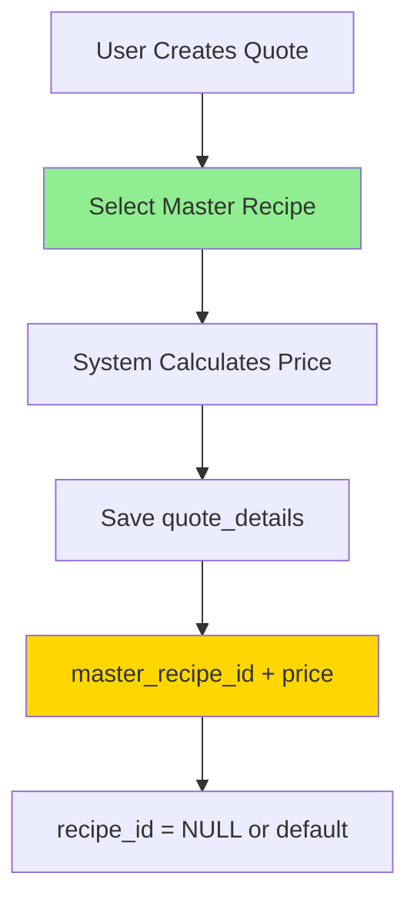
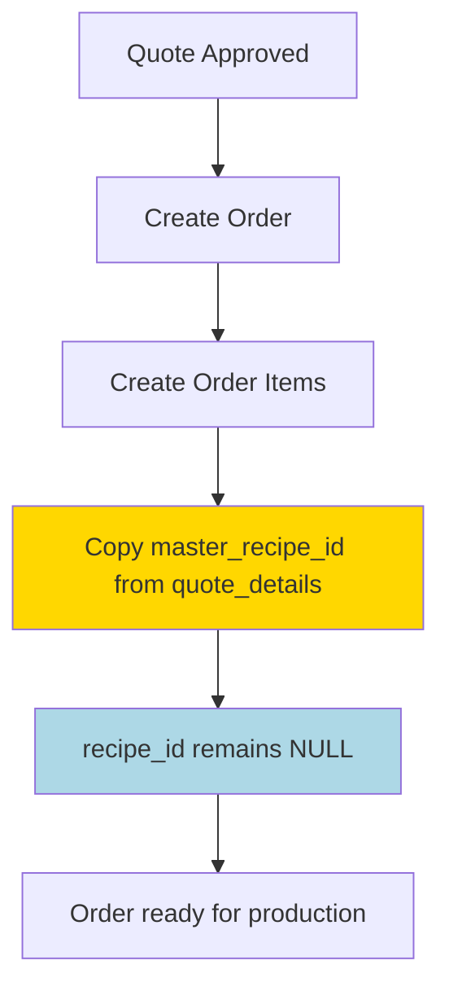
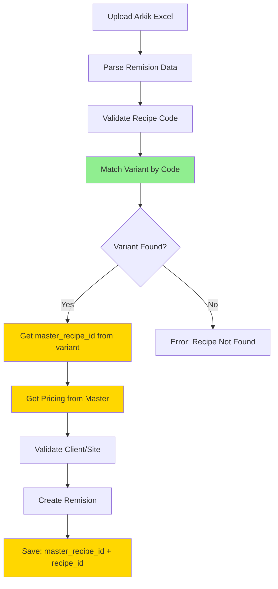

# Master Recipe Implementation Guide

## Executive Summary

This guide outlines the implementation of a **Master-Variant Recipe Architecture** to consolidate recipe variants and simplify pricing management. The key change: **pricing moves from variant level to master level**, with variants determined during production (Arkik processing).

---

## Architecture Overview

### **Current Flow (Variant-Level Pricing)**
```
Quote Creation → Select Variant → Price per Variant
                        ↓
                   Order Items (Variant)
                        ↓
                   Remision (Variant)
                        ↓
            Arkik matches exact variant code
```

### **New Flow (Master-Level Pricing)**
```
Quote Creation → Select Master → Price for ALL Variants
                        ↓
                   Order Items (Master)
                        ↓
                Remision (Master + Variant)
                        ↓
         Arkik matches variant → derives master → gets price
```

---

## Core Concepts

### **Master Recipe**
- Represents a **group of concrete specifications**
- Example: `5-250-2-B-28-14-B` (250 MPa, TMA 20mm, Age 28d, Slump 14cm, Bombeado)
- **One price** applies to all variants
- Used in quotes, orders, reporting

### **Recipe Variant**
- Represents a **specific material formulation**
- Example: `5-250-2-B-28-14-B-3-00M` (Master + "3-00M" suffix)
- Determined by: material availability, additives (PCE vs standard), production conditions
- Matched during Arkik processing
- Used for production tracking

### **Pricing Model**
- **Master-based**: One price per master-client-site combination
- **Variant-agnostic**: Same price for `3-00M`, `2-PCM`, `DIA`, `NOC` variants
- **Simplified quoting**: Users see masters, not variants

---

## Database Schema

### **1. New Table: `master_recipes`**

```sql
CREATE TABLE master_recipes (
  id UUID PRIMARY KEY DEFAULT gen_random_uuid(),
  master_code VARCHAR(100) NOT NULL,
  
  -- Specifications (defining characteristics)
  strength_fc DOUBLE PRECISION NOT NULL,
  age_days INTEGER,
  age_hours INTEGER,
  placement_type VARCHAR(50) NOT NULL,
  max_aggregate_size DOUBLE PRECISION NOT NULL,
  slump DOUBLE PRECISION NOT NULL,
  
  -- Plant association
  plant_id UUID NOT NULL REFERENCES plants(id),
  
  -- Display & metadata
  display_name TEXT,
  description TEXT,
  is_active BOOLEAN DEFAULT true,
  
  -- Audit fields
  created_at TIMESTAMPTZ DEFAULT now(),
  updated_at TIMESTAMPTZ DEFAULT now(),
  created_by UUID REFERENCES auth.users(id),
  
  -- Constraints
  UNIQUE(master_code, plant_id)
);

-- Indexes
CREATE INDEX idx_master_recipes_plant ON master_recipes(plant_id);
CREATE INDEX idx_master_recipes_active ON master_recipes(is_active);
CREATE INDEX idx_master_recipes_specs ON master_recipes(
  plant_id, strength_fc, placement_type, max_aggregate_size
);

-- Comments
COMMENT ON TABLE master_recipes IS 'Master recipe groups representing concrete specifications. One master has multiple variants with same specs but different materials/additives.';
COMMENT ON COLUMN master_recipes.master_code IS 'Code without variant suffix, e.g., "5-250-2-B-28-14-B"';
COMMENT ON COLUMN master_recipes.display_name IS 'User-friendly name for UI display';
```

### **2. Modified Table: `recipes` (Variants)**

```sql
-- Add master reference and variant suffix
ALTER TABLE recipes 
ADD COLUMN master_recipe_id UUID REFERENCES master_recipes(id),
ADD COLUMN variant_suffix VARCHAR(20);

-- Index for master lookup
CREATE INDEX idx_recipes_master ON recipes(master_recipe_id);

-- Comments
COMMENT ON COLUMN recipes.master_recipe_id IS 'Links variant to its master recipe group';
COMMENT ON COLUMN recipes.variant_suffix IS 'Variant identifier from recipe code, e.g., "3-00M", "2-PCM", "DIA"';

-- After migration complete, make NOT NULL
-- ALTER TABLE recipes ALTER COLUMN master_recipe_id SET NOT NULL;
```

### **3. Modified Table: `quote_details` (PRIMARY PRICING)**

```sql
-- Add master reference (becomes PRIMARY key for pricing)
ALTER TABLE quote_details
ADD COLUMN master_recipe_id UUID REFERENCES master_recipes(id);

-- Index for pricing queries
CREATE INDEX idx_quote_details_master ON quote_details(master_recipe_id);

-- Comments
COMMENT ON COLUMN quote_details.master_recipe_id IS 'Primary pricing reference - price applies to all variants of this master';
COMMENT ON COLUMN quote_details.recipe_id IS 'Optional: default variant for reference. Price comes from master.';

-- After migration
-- ALTER TABLE quote_details ALTER COLUMN master_recipe_id SET NOT NULL;
```

### **4. Modified Table: `product_prices` (SECONDARY PRICING)**

```sql
-- Add master reference (becomes PRIMARY key for pricing)
ALTER TABLE product_prices
ADD COLUMN master_recipe_id UUID REFERENCES master_recipes(id);

-- Index for pricing queries
CREATE INDEX idx_product_prices_master ON product_prices(master_recipe_id);

-- Comments
COMMENT ON COLUMN product_prices.master_recipe_id IS 'Primary pricing reference - price applies to all variants of this master';
COMMENT ON COLUMN product_prices.recipe_id IS 'Optional: for backwards compatibility. Price comes from master.';

-- After migration
-- ALTER TABLE product_prices ALTER COLUMN master_recipe_id SET NOT NULL;
```

### **5. Modified Table: `order_items`**

```sql
-- Add master reference
ALTER TABLE order_items
ADD COLUMN master_recipe_id UUID REFERENCES master_recipes(id);

-- Index
CREATE INDEX idx_order_items_master ON order_items(master_recipe_id);

-- Comments
COMMENT ON COLUMN order_items.master_recipe_id IS 'Master recipe ordered. Actual variant determined during production.';
COMMENT ON COLUMN order_items.recipe_id IS 'Optional: default/expected variant. Can be NULL until production.';
```

### **6. Modified Table: `remisiones`**

```sql
-- Add master reference
ALTER TABLE remisiones
ADD COLUMN master_recipe_id UUID REFERENCES master_recipes(id);

-- Index
CREATE INDEX idx_remisiones_master ON remisiones(master_recipe_id);

-- Comments
COMMENT ON COLUMN remisiones.master_recipe_id IS 'Master recipe for pricing and order relationship';
COMMENT ON COLUMN remisiones.recipe_id IS 'Actual variant used in production (from Arkik matching)';

-- After migration (for new remisiones)
-- ALTER TABLE remisiones ALTER COLUMN master_recipe_id SET NOT NULL;
```

---

## Data Flow Diagrams

### **Quote Creation Flow**



### **Order Creation Flow**



### **Arkik Processing Flow**



---

## Migration Strategy

### **Phase 1: Recipe Grouping (Week 1-2)**

#### **Step 1.1: Auto-Generate Master Suggestions**

```sql
-- Query to identify potential master groups
WITH variant_analysis AS (
  SELECT 
    id as variant_id,
    recipe_code,
    arkik_long_code,
    plant_id,
    strength_fc,
    age_days,
    age_hours,
    placement_type,
    max_aggregate_size,
    slump,
    -- Extract master code (remove last 2 segments)
    REGEXP_REPLACE(
      COALESCE(arkik_long_code, recipe_code), 
      '-[^-]+-[^-]+$', 
      ''
    ) as suggested_master_code,
    -- Extract variant suffix (last 2 segments)
    SUBSTRING(
      COALESCE(arkik_long_code, recipe_code) 
      FROM '([^-]+-[^-]+)$'
    ) as variant_suffix
  FROM recipes
  WHERE master_recipe_id IS NULL
    AND (
      arkik_long_code ~ '.*-.*-.*-.*' 
      OR recipe_code ~ '.*-.*-.*-.*'
    )
)
SELECT 
  suggested_master_code,
  plant_id,
  strength_fc,
  age_days,
  age_hours,
  placement_type,
  max_aggregate_size,
  slump,
  COUNT(*) as variant_count,
  array_agg(variant_id) as variant_ids,
  array_agg(recipe_code) as variant_codes,
  array_agg(variant_suffix) as variant_suffixes
FROM variant_analysis
GROUP BY 
  suggested_master_code,
  plant_id,
  strength_fc,
  age_days,
  age_hours,
  placement_type,
  max_aggregate_size,
  slump
HAVING COUNT(*) >= 1
ORDER BY variant_count DESC, suggested_master_code;
```

#### **Step 1.2: Build Grouping UI**

**Component: `MasterRecipeGroupingInterface`**

Features:
- Display auto-generated suggestions
- Show impact analysis (prices affected, orders, remisiones)
- Manual grouping for edge cases
- Validation rules enforcement
- Bulk actions (approve all, skip all)

**Validation Rules:**
1. ✅ All variants in group must have matching specifications
2. ✅ Master code unique per plant
3. ⚠️ Warn if multiple active prices exist (requires consolidation)
4. ⚠️ Warn if recipes used in recent orders/remisiones

#### **Step 1.3: User Training**

**Target Audience:** Plant managers, quality team

**Training Topics:**
1. What is a master vs variant
2. Why consolidation improves workflow
3. How to review auto-suggestions
4. How to handle edge cases
5. Impact on pricing (next phase)

**Deliverable:** Training video + documentation

---

### **Phase 2: Price Consolidation (Week 3)**

#### **Step 2.1: Analyze Pricing Conflicts**

```sql
-- Find masters with multiple prices from variants
WITH master_prices AS (
  SELECT 
    r.master_recipe_id,
    mr.master_code,
    pp.client_id,
    c.business_name,
    pp.construction_site,
    pp.base_price,
    pp.recipe_id as variant_id,
    r.recipe_code as variant_code,
    pp.effective_date,
    pp.is_active,
    'product_prices' as source
  FROM product_prices pp
  JOIN recipes r ON pp.recipe_id = r.id
  JOIN master_recipes mr ON r.master_recipe_id = mr.id
  LEFT JOIN clients c ON pp.client_id = c.id
  WHERE pp.is_active = true
  
  UNION ALL
  
  SELECT 
    r.master_recipe_id,
    mr.master_code,
    q.client_id,
    c.business_name,
    q.construction_site,
    qd.final_price as base_price,
    qd.recipe_id as variant_id,
    r.recipe_code as variant_code,
    q.created_at as effective_date,
    true as is_active,
    'quote_details' as source
  FROM quote_details qd
  JOIN quotes q ON qd.quote_id = q.id
  JOIN recipes r ON qd.recipe_id = r.id
  JOIN master_recipes mr ON r.master_recipe_id = mr.id
  LEFT JOIN clients c ON q.client_id = c.id
  WHERE q.status = 'APPROVED'
)
SELECT 
  master_recipe_id,
  master_code,
  client_id,
  business_name,
  construction_site,
  COUNT(DISTINCT base_price) as price_variations,
  array_agg(DISTINCT base_price ORDER BY base_price) as different_prices,
  array_agg(DISTINCT variant_code) as variants_with_prices,
  array_agg(DISTINCT source) as price_sources
FROM master_prices
GROUP BY 
  master_recipe_id,
  master_code,
  client_id,
  business_name,
  construction_site
HAVING COUNT(DISTINCT base_price) > 1
ORDER BY price_variations DESC;
```

#### **Step 2.2: Price Conflict Resolution UI**

**Component: `PriceConflictResolver`**

For each conflict, show:
- Master code + specifications
- Client + Site
- All variant prices with dates
- Recommended action

**Resolution Options:**
1. **Use Most Recent Price** (recommended)
2. **Use Highest Price** (conservative)
3. **Use Lowest Price** (competitive)
4. **Manual Entry** (custom)

**Example:**
```
Master: 5-250-2-B-28-14-B (250 MPa, 28d, Bombeado)
Client: DESARROLLADORA MARABIS
Site: IKD2

Price Conflicts:
┌────────────────────────────────────────────────────────────┐
│ Variant: 5-250-2-B-28-14-B-3-00M                          │
│ Source: product_prices                                     │
│ Price: $1,822.68                                          │
│ Date: 2025-08-15                                          │
├────────────────────────────────────────────────────────────┤
│ Variant: 5-250-2-B-28-14-B-2-PCM                         │
│ Source: quote_details (Quote #Q-2025-089)                │
│ Price: $1,853.51                                          │
│ Date: 2025-09-20  ← MOST RECENT                          │
└────────────────────────────────────────────────────────────┘

Recommended: $1,853.51 (most recent)

[Accept Recommendation] [Select Different Price] [Manual Entry]
```

#### **Step 2.3: Execute Price Migration**

```sql
-- Migration Script: Consolidate Pricing to Masters

-- Step 2.3.1: Migrate product_prices (simple cases - no conflicts)
INSERT INTO product_prices (
  master_recipe_id,
  client_id,
  construction_site,
  plant_id,
  base_price,
  is_active,
  effective_date,
  created_at,
  code,
  description,
  fc_mr_value,
  type,
  age_days,
  placement_type,
  max_aggregate_size,
  slump
)
SELECT DISTINCT ON (r.master_recipe_id, pp.client_id, pp.construction_site)
  r.master_recipe_id,
  pp.client_id,
  pp.construction_site,
  pp.plant_id,
  pp.base_price,
  pp.is_active,
  pp.effective_date,
  now(),
  mr.master_code,
  mr.display_name,
  mr.strength_fc,
  pp.type,
  mr.age_days,
  mr.placement_type,
  mr.max_aggregate_size,
  mr.slump
FROM product_prices pp
JOIN recipes r ON pp.recipe_id = r.id
JOIN master_recipes mr ON r.master_recipe_id = mr.id
WHERE pp.is_active = true
  AND r.master_recipe_id IS NOT NULL
  -- Only where no master price exists yet
  AND NOT EXISTS (
    SELECT 1 FROM product_prices pp2
    WHERE pp2.master_recipe_id = r.master_recipe_id
      AND pp2.client_id = pp.client_id
      AND COALESCE(pp2.construction_site, '') = COALESCE(pp.construction_site, '')
  )
ORDER BY 
  r.master_recipe_id, 
  pp.client_id, 
  pp.construction_site,
  pp.effective_date DESC;

-- Step 2.3.2: Update quote_details
UPDATE quote_details qd
SET master_recipe_id = r.master_recipe_id
FROM recipes r
WHERE qd.recipe_id = r.id
  AND r.master_recipe_id IS NOT NULL
  AND qd.master_recipe_id IS NULL;

-- Step 2.3.3: Update order_items
UPDATE order_items oi
SET master_recipe_id = r.master_recipe_id
FROM recipes r
WHERE oi.recipe_id = r.id
  AND r.master_recipe_id IS NOT NULL
  AND oi.master_recipe_id IS NULL;

-- Step 2.3.4: Update remisiones (recent only)
UPDATE remisiones rem
SET master_recipe_id = r.master_recipe_id
FROM recipes r
WHERE rem.recipe_id = r.id
  AND r.master_recipe_id IS NOT NULL
  AND rem.master_recipe_id IS NULL
  AND rem.fecha >= CURRENT_DATE - INTERVAL '90 days';
```

#### **Step 2.4: Validation Checks**

```sql
-- Validation Query Set

-- V1: All active recipes have masters
SELECT 
  COUNT(*) as ungrouped_recipes,
  array_agg(recipe_code) as codes
FROM recipes
WHERE is_active = true
  AND master_recipe_id IS NULL
  AND (arkik_long_code ~ '.*-.*' OR recipe_code ~ '.*-.*');
-- Expected: 0

-- V2: All recent quote_details have masters
SELECT COUNT(*) as missing_master
FROM quote_details qd
JOIN quotes q ON qd.quote_id = q.id
WHERE qd.master_recipe_id IS NULL
  AND q.status IN ('APPROVED', 'PENDING_APPROVAL')
  AND q.created_at >= CURRENT_DATE - INTERVAL '90 days';
-- Expected: 0

-- V3: All recent order_items have masters
SELECT COUNT(*) as missing_master
FROM order_items oi
JOIN orders o ON oi.order_id = o.id
WHERE oi.master_recipe_id IS NULL
  AND o.created_at >= CURRENT_DATE - INTERVAL '30 days';
-- Expected: 0

-- V4: Pricing coverage check
SELECT 
  mr.master_code,
  COUNT(DISTINCT pp.client_id) as clients_with_prices
FROM master_recipes mr
LEFT JOIN product_prices pp ON pp.master_recipe_id = mr.id AND pp.is_active = true
WHERE mr.is_active = true
GROUP BY mr.id, mr.master_code
HAVING COUNT(DISTINCT pp.client_id) = 0;
-- Review: Masters without any pricing (may need setup)

-- V5: Price conflict check (should be 0 after resolution)
WITH master_prices AS (
  SELECT 
    master_recipe_id,
    client_id,
    construction_site,
    base_price
  FROM product_prices
  WHERE is_active = true
    AND master_recipe_id IS NOT NULL
)
SELECT 
  master_recipe_id,
  client_id,
  construction_site,
  COUNT(DISTINCT base_price) as price_count
FROM master_prices
GROUP BY master_recipe_id, client_id, construction_site
HAVING COUNT(DISTINCT base_price) > 1;
-- Expected: 0 (all conflicts resolved)
```

---

### **Phase 3: Application Updates (Week 4)**

#### **3.1: Update Quote Creation**

**File: `src/components/quotes/QuoteCreationModal.tsx`**

```typescript
// BEFORE: User selects variant
<RecipeSelector 
  onSelect={(recipe) => setSelectedRecipe(recipe)}
  recipes={allRecipes} // All variants visible
/>

// AFTER: User selects master
<MasterRecipeSelector 
  onSelect={(master) => setSelectedMaster(master)}
  masters={masters} // Only masters visible
/>

// BEFORE: Save quote_detail with variant
const quoteDetail = {
  recipe_id: selectedRecipe.id,
  base_price: calculatedPrice,
  // ...
};

// AFTER: Save quote_detail with master
const quoteDetail = {
  master_recipe_id: selectedMaster.id,
  recipe_id: null, // Or default variant if needed
  base_price: calculatedPrice,
  // ...
};
```

**New Component: `MasterRecipeSelector`**

```typescript
interface MasterRecipeSelectorProps {
  plantId: string;
  onSelect: (master: MasterRecipe) => void;
  selectedMaster?: MasterRecipe | null;
}

export function MasterRecipeSelector({ 
  plantId, 
  onSelect,
  selectedMaster 
}: MasterRecipeSelectorProps) {
  const { data: masters, isLoading } = useQuery({
    queryKey: ['masters', plantId],
    queryFn: async () => {
      const { data } = await supabase
        .from('master_recipes')
        .select('*')
        .eq('plant_id', plantId)
        .eq('is_active', true)
        .order('master_code');
      return data;
    }
  });

  return (
    <div className="space-y-2">
      <Label>Seleccionar Receta Maestra</Label>
      <Select 
        value={selectedMaster?.id} 
        onValueChange={(id) => {
          const master = masters?.find(m => m.id === id);
          if (master) onSelect(master);
        }}
      >
        <SelectTrigger>
          <SelectValue placeholder="Seleccione una receta..." />
        </SelectTrigger>
        <SelectContent>
          {masters?.map(master => (
            <SelectItem key={master.id} value={master.id}>
              {master.master_code} - {master.display_name}
              <span className="text-xs text-gray-500 ml-2">
                {master.strength_fc} MPa, {master.age_days}d, 
                TMA {master.max_aggregate_size}mm, 
                Rev {master.slump}cm
              </span>
            </SelectItem>
          ))}
        </SelectContent>
      </Select>
    </div>
  );
}
```

#### **3.2: Update Arkik Validator**

**File: `src/services/arkikValidator.ts`**

```typescript
// Update validation to resolve pricing from master

export class DebugArkikValidator {
  async validate(rows: ArkikRawRow[]): Promise<StagingRemision[]> {
    // ... existing code for client/site validation
    
    for (const row of rows) {
      // Step 1: Match variant by code (UNCHANGED)
      const variant = findRecipeMatch(
        row.product_description, 
        this.recipes
      );
      
      if (!variant) {
        results.push({
          validation_status: 'error',
          error_type: 'RECIPE_NOT_FOUND',
          // ... error handling
        });
        continue;
      }
      
      // Step 2: Get master from variant (NEW)
      const master = this.masters.find(
        m => m.id === variant.master_recipe_id
      );
      
      if (!master) {
        results.push({
          validation_status: 'warning',
          error_type: 'RECIPE_MISSING_MASTER',
          message: `Receta encontrada pero no vinculada a maestra. 
                   Contactar a Calidad.`,
          // ... warning details
        });
        continue;
      }
      
      // Step 3: Resolve pricing from MASTER (CHANGED)
      const pricing = await this.resolvePricingFromMaster(
        master.id,
        client.id,
        site?.id
      );
      
      if (!pricing) {
        results.push({
          validation_status: 'error',
          error_type: 'PRICING_NOT_FOUND',
          // ... error handling
        });
        continue;
      }
      
      // Step 4: Return validated remision
      results.push({
        validation_status: 'valid',
        recipe_id: variant.id, // Variant for Arkik traceability
        master_recipe_id: master.id, // Master for pricing
        unit_price: pricing.unit_price,
        // ... other fields
      });
    }
    
    return results;
  }
  
  // NEW METHOD: Resolve pricing from master (not variant)
  private async resolvePricingFromMaster(
    masterRecipeId: string,
    clientId: string,
    siteId?: string
  ): Promise<PricingResult | null> {
    // Priority 1: product_prices with master_recipe_id
    const { data: productPrices } = await supabase
      .from('product_prices')
      .select('*')
      .eq('master_recipe_id', masterRecipeId)
      .eq('is_active', true);
    
    // Priority 2: quote_details from approved quotes
    const { data: quotePrices } = await supabase
      .from('quote_details')
      .select(`
        *,
        quotes!inner(status, client_id, construction_site)
      `)
      .eq('master_recipe_id', masterRecipeId)
      .eq('quotes.status', 'APPROVED');
    
    // Combine and score pricing options
    const allPrices = [
      ...productPrices.map(p => ({ 
        ...p, 
        source: 'product_prices' 
      })),
      ...quotePrices.map(q => ({ 
        ...q, 
        source: 'quotes',
        client_id: q.quotes.client_id,
        construction_site: q.quotes.construction_site
      }))
    ];
    
    // Apply scoring logic (client match, site match, recency)
    const scored = allPrices.map(price => ({
      ...price,
      score: this.calculatePriceScore(price, clientId, siteId)
    }));
    
    // Select best match
    const bestMatch = scored.sort((a, b) => b.score - a.score)[0];
    
    // Validate match quality
    if (!bestMatch || bestMatch.score < MINIMUM_ACCEPTABLE_SCORE) {
      return null;
    }
    
    return {
      unit_price: bestMatch.base_price || bestMatch.final_price,
      source: bestMatch.source,
      client_id: bestMatch.client_id,
      construction_site_id: bestMatch.construction_site_id
    };
  }
}
```

#### **3.3: Update Order Creation**

**File: `src/services/arkikOrderCreator.ts`**

```typescript
// Update order creation to use masters

export class ArkikOrderCreator {
  async createOrders(
    groupedRemisions: OrderSuggestion[]
  ): Promise<CreationResult> {
    for (const suggestion of groupedRemisions) {
      // Create order
      const { data: order } = await supabase
        .from('orders')
        .insert({
          client_id: suggestion.client_id,
          construction_site_id: suggestion.site_id,
          // ... other fields
        })
        .select()
        .single();
      
      // Create order items (one per master)
      const masterGroups = this.groupByMaster(suggestion.remisions);
      
      for (const [masterRecipeId, remisions] of masterGroups) {
        const totalVolume = remisions.reduce(
          (sum, r) => sum + r.volumen_fabricado, 
          0
        );
        
        await supabase
          .from('order_items')
          .insert({
            order_id: order.id,
            master_recipe_id: masterRecipeId, // MASTER
            recipe_id: null, // Variant TBD during production
            product_type: 'concrete',
            volume: totalVolume,
            unit_price: remisions[0].unit_price, // From master
            total_price: totalVolume * remisions[0].unit_price
          });
      }
      
      // Create remisiones
      for (const remisionData of suggestion.remisions) {
        await supabase
          .from('remisiones')
          .insert({
            order_id: order.id,
            remision_number: remisionData.remision_number,
            recipe_id: remisionData.recipe_id, // VARIANT (Arkik)
            master_recipe_id: remisionData.master_recipe_id, // MASTER
            fecha: remisionData.fecha,
            hora_carga: remisionData.hora_carga,
            volumen_fabricado: remisionData.volumen_fabricado,
            // ... other fields
          });
      }
    }
  }
  
  private groupByMaster(
    remisions: ValidatedRemision[]
  ): Map<string, ValidatedRemision[]> {
    return remisions.reduce((map, rem) => {
      const key = rem.master_recipe_id;
      const group = map.get(key) || [];
      group.push(rem);
      map.set(key, group);
      return map;
    }, new Map());
  }
}
```

#### **3.4: Update Reporting Queries**

**File: `src/lib/supabase/reports.ts`**

```typescript
// NEW: Volume by Master Recipe Report

export async function getVolumeByMaster(
  plantId: string,
  startDate: string,
  endDate: string
) {
  const { data, error } = await supabase
    .from('remisiones')
    .select(`
      volumen_fabricado,
      master_recipe_id,
      master_recipes!inner(
        master_code,
        display_name,
        strength_fc,
        placement_type
      )
    `)
    .eq('plant_id', plantId)
    .gte('fecha', startDate)
    .lte('fecha', endDate);
  
  if (error) throw error;
  
  // Group and sum by master
  const grouped = data.reduce((acc, row) => {
    const key = row.master_recipe_id;
    if (!acc[key]) {
      acc[key] = {
        master_code: row.master_recipes.master_code,
        display_name: row.master_recipes.display_name,
        strength_fc: row.master_recipes.strength_fc,
        placement_type: row.master_recipes.placement_type,
        total_volume: 0
      };
    }
    acc[key].total_volume += row.volumen_fabricado;
    return acc;
  }, {});
  
  return Object.values(grouped);
}

// BEFORE (fragmented by variant)
// SELECT recipe_id, SUM(volume) FROM remisiones GROUP BY recipe_id
// Returns: 5-250-2-B-28-14-B-3-00M: 10m³
//          5-250-2-B-28-14-B-2-PCM: 8m³
//          5-250-2-B-28-14-B-DIA: 5m³

// AFTER (consolidated by master)
// Returns: 5-250-2-B-28-14-B: 23m³ ✓ (automatic consolidation)
```

---

### **Phase 4: Testing & Validation (Week 5)**

#### **4.1: Unit Tests**

```typescript
// Test: Recipe matching still works
describe('findRecipeMatch', () => {
  it('should match variant by exact arkik_long_code', () => {
    const variant = findRecipeMatch(
      '5-250-2-B-28-14-B-3-00M',
      recipes
    );
    expect(variant).toBeDefined();
    expect(variant.arkik_long_code).toBe('5-250-2-B-28-14-B-3-00M');
    expect(variant.master_recipe_id).toBeDefined();
  });
  
  it('should not fuzzy match different recipes', () => {
    const variant = findRecipeMatch(
      '6-200-2-B-28-10-D-2-000', // Wrong recipe
      recipes
    );
    expect(variant).toBeNull(); // Should NOT match 6-250-...
  });
});

// Test: Pricing resolution from master
describe('resolvePricingFromMaster', () => {
  it('should resolve price from master, not variant', async () => {
    const pricing = await validator.resolvePricingFromMaster(
      'master-uuid-123',
      'client-uuid-456',
      'site-uuid-789'
    );
    
    expect(pricing).toBeDefined();
    expect(pricing.unit_price).toBeGreaterThan(0);
    expect(pricing.source).toMatch(/product_prices|quotes/);
  });
  
  it('should return null if no pricing for master', async () => {
    const pricing = await validator.resolvePricingFromMaster(
      'master-without-prices',
      'client-uuid',
      'site-uuid'
    );
    
    expect(pricing).toBeNull();
  });
});
```

#### **4.2: Integration Tests**

**Test Scenarios:**

1. **Quote → Order → Remision Flow**
   ```
   1. Create quote with master recipe
   2. Approve quote
   3. Create order from quote
   4. Upload Arkik file with variant code
   5. Validate: remision has both master + variant
   6. Validate: pricing came from master
   ```

2. **Arkik Upload - Dedicated Mode**
   ```
   1. Upload Arkik Excel with various recipes
   2. Validator matches variants → derives masters
   3. Pricing resolved from masters
   4. Orders auto-created
   5. Validate: all remisiones have master_recipe_id
   ```

3. **Arkik Upload - Commercial Mode**
   ```
   1. Create order manually with master
   2. Upload Arkik file
   3. Matcher finds existing order by master
   4. Assigns remisiones to order
   5. Validate: order_items match by master
   ```

4. **Reporting: Volume by Master**
   ```
   1. Create remisiones with different variants of same master
   2. Run volume report
   3. Validate: consolidated total by master
   ```

#### **4.3: User Acceptance Testing**

**Test Users:**
- Plant Manager (Dosificador)
- Sales Agent (Commercial)
- Quality Team
- Accounting

**Test Cases:**
1. Create quote with new master-based selector
2. Process Arkik upload (Dedicated mode)
3. Process Arkik upload (Commercial mode)
4. View consolidated reports
5. Handle duplicate remisiones
6. Handle pricing conflicts during migration

---

### **Phase 5: Deployment & Monitoring (Week 6)**

#### **5.1: Pre-Deployment Checklist**

```bash
# Database readiness
☐ All migrations executed successfully
☐ All indexes created
☐ RLS policies updated
☐ Validation queries pass (0 errors)
☐ Backup created

# Application readiness
☐ All components updated
☐ Tests pass (unit + integration)
☐ Staging deployment successful
☐ User training completed

# Data integrity
☐ All active recipes have masters
☐ All recent quotes have master pricing
☐ All recent orders have masters
☐ Price conflicts resolved
```

#### **5.2: Deployment Steps**

```bash
# Step 1: Database migrations (off-peak hours)
psql -h <host> -U <user> -d <database> -f migrations/001_create_master_recipes.sql
psql -h <host> -U <user> -d <database> -f migrations/002_add_master_to_recipes.sql
psql -h <host> -U <user> -d <database> -f migrations/003_add_master_to_pricing.sql
psql -h <host> -U <user> -d <database> -f migrations/004_migrate_pricing_data.sql

# Step 2: Run validation suite
psql -h <host> -U <user> -d <database> -f validations/validate_all.sql

# Step 3: Deploy application (zero-downtime)
vercel deploy --prod

# Step 4: Monitor for errors
# Check Sentry/logs for 24 hours
# Watch Supabase dashboard for slow queries
```

#### **5.3: Monitoring Metrics**

**Week 1 Post-Launch:**
- [ ] No pricing resolution failures
- [ ] Arkik uploads successful (>95%)
- [ ] Quote creation time unchanged
- [ ] Report generation performance acceptable

**KPIs:**
- Arkik validation success rate: >95%
- Quote creation time: <5 seconds
- Price conflict rate: 0% (after resolution)
- User support tickets: <5 per week

---

## Rollback Plan

### **Scenario: Critical Issue Found**

```sql
-- Emergency Rollback: Revert to variant-based pricing

-- Step 1: Update Arkik validator to use recipe_id for pricing
-- (Code change only, deploy immediately)

-- Step 2: Optionally clear master references (if needed)
UPDATE quote_details SET master_recipe_id = NULL;
UPDATE order_items SET master_recipe_id = NULL;
UPDATE remisiones SET master_recipe_id = NULL;

-- Step 3: Drop master_recipes table (if needed)
-- CAUTION: Only if absolutely necessary
-- DROP TABLE IF EXISTS master_recipes CASCADE;
```

**Trigger Conditions:**
- Pricing resolution fails >10% of Arkik uploads
- Orders created with incorrect prices
- Data corruption detected
- Critical bug in grouping logic

---

## Success Criteria

### **Technical Success**
✅ All recipes grouped into masters  
✅ Zero price conflicts remaining  
✅ Arkik upload success rate >95%  
✅ Quote → Order → Remision flow working  
✅ Reports consolidated by master  

### **Business Success**
✅ Quote creation time reduced (simpler UI)  
✅ Pricing errors eliminated  
✅ Reporting clarity improved  
✅ User satisfaction high (survey >4/5)  

### **Data Integrity**
✅ All active pricing has master reference  
✅ All recent remisiones have master  
✅ Variant codes still match correctly  
✅ No orphaned records  

---

## Support & Training

### **Documentation Deliverables**
1. User Guide: "Working with Master Recipes"
2. Technical Guide: "Master-Variant Architecture"
3. Admin Guide: "Price Consolidation Process"
4. Troubleshooting Guide: "Common Issues & Solutions"

### **Training Sessions**
1. **Sales Team:** Quote creation with masters
2. **Plant Operators:** Understanding Arkik matching
3. **Quality Team:** Recipe grouping & maintenance
4. **Management:** Reporting & analytics

### **Support Contacts**
- **Technical Issues:** Development Team (Slack #dev-support)
- **Pricing Questions:** Accounting Team
- **Recipe Grouping:** Quality Team
- **Arkik Uploads:** Operations Team

---

## Appendix

### **A. TypeScript Types**

```typescript
// Master Recipe
export interface MasterRecipe {
  id: string;
  master_code: string;
  strength_fc: number;
  age_days: number | null;
  age_hours: number | null;
  placement_type: string;
  max_aggregate_size: number;
  slump: number;
  plant_id: string;
  display_name: string | null;
  description: string | null;
  is_active: boolean;
  created_at: string;
  updated_at: string;
  created_by: string | null;
}

// Recipe Variant (extended)
export interface Recipe {
  id: string;
  recipe_code: string;
  master_recipe_id: string | null; // NEW
  variant_suffix: string | null; // NEW
  arkik_long_code: string | null;
  arkik_short_code: string | null;
  // ... existing fields
}

// Quote Detail (extended)
export interface QuoteDetail {
  id: string;
  quote_id: string;
  master_recipe_id: string | null; // NEW (primary)
  recipe_id: string | null; // OPTIONAL (reference)
  base_price: number;
  final_price: number;
  // ... existing fields
}

// Validated Remision (extended)
export interface StagingRemision {
  remision_number: string;
  recipe_id: string | null; // Variant (from Arkik)
  master_recipe_id: string; // NEW (for pricing)
  unit_price: number;
  validation_status: 'valid' | 'warning' | 'error';
  // ... existing fields
}
```

### **B. Database Views (Reporting)**

```sql
-- View: Master Recipe Summary
CREATE OR REPLACE VIEW v_master_recipe_summary AS
SELECT 
  mr.id,
  mr.master_code,
  mr.display_name,
  mr.strength_fc,
  mr.placement_type,
  COUNT(DISTINCT r.id) as variant_count,
  COUNT(DISTINCT pp.client_id) as clients_with_pricing,
  COALESCE(SUM(rem.volumen_fabricado), 0) as total_volume_30d
FROM master_recipes mr
LEFT JOIN recipes r ON r.master_recipe_id = mr.id
LEFT JOIN product_prices pp ON pp.master_recipe_id = mr.id AND pp.is_active = true
LEFT JOIN remisiones rem ON rem.master_recipe_id = mr.id 
  AND rem.fecha >= CURRENT_DATE - INTERVAL '30 days'
WHERE mr.is_active = true
GROUP BY mr.id, mr.master_code, mr.display_name, mr.strength_fc, mr.placement_type;

-- View: Pricing Coverage
CREATE OR REPLACE VIEW v_pricing_coverage AS
SELECT 
  mr.master_code,
  c.business_name as client_name,
  cs.name as site_name,
  pp.base_price,
  pp.effective_date,
  pp.is_active
FROM master_recipes mr
CROSS JOIN clients c
LEFT JOIN construction_sites cs ON cs.client_id = c.id
LEFT JOIN product_prices pp ON pp.master_recipe_id = mr.id 
  AND pp.client_id = c.id 
  AND (pp.construction_site = cs.name OR pp.construction_site IS NULL)
WHERE mr.is_active = true
  AND c.is_active = true
ORDER BY mr.master_code, c.business_name, cs.name;
```

### **C. Migration Scripts**

All migration SQL scripts are provided in the `/migrations` directory:

1. `001_create_master_recipes.sql` - Create master table
2. `002_add_master_to_recipes.sql` - Add master FK to recipes
3. `003_add_master_to_pricing.sql` - Add master FK to pricing tables
4. `004_migrate_pricing_data.sql` - Consolidate pricing to masters
5. `005_create_indexes.sql` - Performance indexes
6. `006_create_views.sql` - Reporting views

---

## Timeline Summary

```
Week 1: Schema + Grouping UI Setup
  Day 1-2: Create tables, indexes
  Day 3-5: Build grouping interface

Week 2: User Grouping Phase
  Day 1: User training
  Day 2-5: Users group recipes (monitored)

Week 3: Price Migration
  Day 1-2: Conflict analysis + resolution
  Day 3: Execute migration
  Day 4-5: Validation + fixes

Week 4: Application Updates
  Day 1-2: Update quote/order creation
  Day 3-4: Update Arkik validator
  Day 5: Update reporting

Week 5: Testing
  Day 1-2: Unit + integration tests
  Day 3-4: User acceptance testing
  Day 5: Final fixes

Week 6: Deployment
  Day 1: Staging deployment
  Day 2: Production deployment
  Day 3-5: Monitoring + support
```

---

## Contact & Questions

**Project Manager:** [Name]  
**Technical Lead:** [Name]  
**Database Lead:** [Name]  

**Slack Channels:**
- `#master-recipe-project` - General discussion
- `#dev-support` - Technical issues
- `#user-feedback` - User reports

---

**Version:** 1.0  
**Last Updated:** 2025-01-20  
**Status:** Ready for Implementation