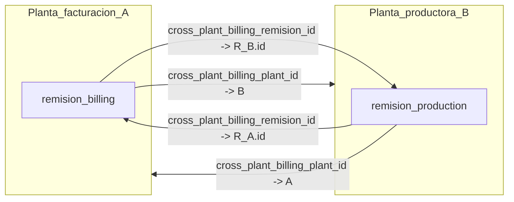

# Producción cross-plant y vínculo de remisiones

Documentación técnica (Parte A) y procedimientos operativos — SOPs (Parte B) para el flujo en el que el concreto se produce en una planta y la facturación u orden comercial vive en otra. Implementación alineada con los cambios recientes en el procesamiento Arkik, APIs de vínculo y pantallas de control de producción, calidad y finanzas.

---

## Tabla de contenidos

### Parte A — Sistema y técnica

1. [Resumen de negocio](#1-resumen-de-negocio)
2. [Terminología](#2-terminología)
3. [Modelo de datos](#3-modelo-de-datos)
4. [Detección y staging (Arkik)](#4-detección-y-staging-arkik)
5. [Persistencia y orden de carga](#5-persistencia-y-orden-de-carga)
6. [Resolución del vínculo (correlación)](#6-resolución-del-vínculo-correlación)
7. [Superficies en la aplicación y reportes](#7-superficies-en-la-aplicación-y-reportes)
8. [Reglas de negocio, guardas y exclusiones analíticas](#8-reglas-de-negocio-guardas-y-exclusiones-analíticas)
9. [Seguridad y RLS](#9-seguridad-y-rls)
10. [Riesgos operativos y casos límite](#10-riesgos-operativos-y-casos-límite)
11. [Índice de rutas API](#11-índice-de-rutas-api)
12. [Índice de archivos de código](#12-índice-de-archivos-de-código)

### Parte B — SOPs (procedimientos operativos)

- [Glosario breve para operación](#glosario-breve-para-operación)
- [SOP 1 — Planta productora (Plant B)](#sop-1--planta-productora-plant-b-arkik)
- [SOP 2 — Planta de facturación (Plant A)](#sop-2--planta-de-facturación-plant-a-arkik)
- [SOP 3 — Monitoreo de vínculos pendientes](#sop-3--monitoreo-de-vínculos-pendientes)
- [SOP 4 — Confirmación de remisión y FIFO](#sop-4--confirmación-de-remisión-y-fifo)
- [SOP 5 — Calidad / muestreos](#sop-5--calidad--muestreos)
- [SOP 6 — Finanzas y reportes](#sop-6--finanzas-y-reportes)
- [SOP 7 — Errores y escalación](#sop-7--errores-y-escalación)

---

# Parte A — Sistema y técnica

## 1. Resumen de negocio

En operaciones multi-planta puede ocurrir que:

- La **planta de facturación (Plant A)** registre la remisión comercial ligada a la **orden** (cliente, obra, precio).
- La **planta productora (Plant B)** fabrique el concreto y su Arkik traiga **materiales reales** y datos de producción.

El sistema evita duplicar volumen en métricas agregadas y permite **correlacionar** dos filas en `remisiones`: una “de facturación” y otra “solo producción”, enlazadas por identificadores y por la tabla de pendientes cuando una planta sube su archivo antes que la otra.

**“Correlación”** en este módulo significa **emparejar** la remisión de facturación con la remisión de producción (bidireccional), no análisis estadístico.

## 2. Terminología

| Concepto | Significado |
|----------|-------------|
| **Lado facturación (Plant A)** | `is_production_record = false`, típicamente con `order_id`. Puede tener `cross_plant_billing_plant_id` = planta que **produjo**. |
| **Lado producción (Plant B)** | `is_production_record = true`, `order_id = null`, `cancelled_reason = 'cross_plant_production'`. Materiales en `remision_materiales` de esta fila. |
| **Vínculo resuelto** | Ambas remisiones tienen `cross_plant_billing_remision_id` apuntando al **id** de la otra remisión, y `cross_plant_billing_plant_id` apuntando a la **otra planta**. |
| **Vínculo pendiente** | Registro en `cross_plant_pending_links` cuando Plant B ya creó su remisión de producción pero aún no existía la remisión de facturación en Plant A al momento del enlace. |

## 3. Modelo de datos

### 3.1 Tabla `remisiones` (campos relevantes)

| Campo | Uso |
|-------|-----|
| `is_production_record` | `true` = registro solo producción (sin orden); `false` = remisión operativa normal con orden. |
| `cancelled_reason` | En producción cross-plant suele ser `'cross_plant_production'` (semántica de “motivo especial”, no necesariamente cancelación comercial). |
| `cross_plant_billing_plant_id` | UUID de la **otra** planta (facturación o producción, según el lado de la fila). |
| `cross_plant_billing_remision_id` | UUID de la **otra** remisión emparejada. |

> **Nota:** Confirmar tipos exactos, índices y restricciones en Supabase (Table Editor o migraciones). Este documento refleja el uso en código de aplicación.

### 3.2 Tabla `cross_plant_pending_links`

Almacena intentos de enlace cuando la remisión objetivo en la planta de facturación **aún no existe**:

| Campo (uso en código) | Rol |
|----------------------|-----|
| `source_remision_id` | Id de la remisión de **producción** recién creada (Plant B). |
| `source_plant_id` | Planta productora. |
| `target_remision_number` | Número de remisión esperado en la planta de facturación. |
| `target_plant_id` | Planta de facturación. |
| `session_id` | Sesión de procesamiento Arkik (trazabilidad). |

### 3.3 Diagrama — vínculo bidireccional resuelto

## 4. Detección y staging (Arkik)

### 4.1 Validador

En `src/services/arkikValidator.ts`, una fila **TERMINADO** con **todos** los materiales reales en cero genera un aviso recuperable (`ZERO_MATERIAL_TERMINADO`) con sugerencia `cross_plant_production`, indicando que puede ser producción en otra planta y que la confirmación puede quedar bloqueada hasta exista vínculo.

### 4.2 Procesador de estatus

`src/services/arkikStatusProcessor.ts`:

- **`processForCrossPlantProduction`**: marca staging para guardar en BD como producción cross-plant (`is_production_record = true`, `order_id` null al crear, etc.), con metadatos `cross_plant_target_plant_id`, `cross_plant_target_plant_name`, `cross_plant_target_remision_number`, `cross_plant_confirmed`.
- **`processForCrossPlantBilling`**: remisión normal con orden; en creación se propaga `cross_plant_billing_plant_id` vía `cross_plant_target_plant_id` (planta productora).

### 4.3 Diálogo de estatus y vista previa

`src/components/arkik/StatusProcessingDialog.tsx` usa `GET /api/arkik/cross-plant-preview` con `plant_id` y `remision_number` de la **planta de facturación** para validar si la remisión objetivo existe. Si existe, se marca `cross_plant_confirmed` en la decisión.

La ruta de preview usa cliente admin (service role) para **saltar RLS** entre plantas y aplica un **límite de frecuencia por usuario** en memoria (ver riesgos en sección 10).

## 5. Persistencia y orden de carga

### 5.1 Remisiones con orden (facturación)

`src/services/arkikOrderCreator.ts` inserta remisiones normales con `cross_plant_billing_plant_id: fullRemisionData.cross_plant_target_plant_id` cuando aplica.

### 5.2 Remisiones solo producción

`createCrossPlantProductionRemisiones` en `arkikOrderCreator.ts`:

- Inserta `order_id: null`, `is_production_record: true`, `cancelled_reason: 'cross_plant_production'`, `cross_plant_billing_plant_id` = planta de facturación objetivo (si conocida).
- Inserta `remision_materiales` en la planta **productora**.

### 5.3 Orquestación en `ArkikProcessor`

`src/components/arkik/ArkikProcessor.tsx`:

- Excluye `is_production_record` del agrupado de órdenes listo para creación normal.
- Tras crear remisiones de producción cross-plant, llama `POST /api/arkik/cross-plant-link` por cada resultado con planta y número objetivo.
- Tras importar remisiones de facturación, llama `POST /api/arkik/resolve-pending-links` para cerrar filas pendientes cuando ya existan los números en Plant A.

**Orden de carga:** si Plant B sube primero, el vínculo queda **pending** hasta que Plant A cree la remisión con el **mismo número** referenciado; si Plant A ya existe, el enlace es **inmediato**.

## 6. Resolución del vínculo (correlación)

### 6.1 `POST /api/arkik/cross-plant-link`

- Busca en `remisiones` la remisión de facturación: `remision_number` + `plant_id` + `is_production_record = false`.
- Si **no** existe: `INSERT` en `cross_plant_pending_links`, respuesta `pending`.
- Si existe: `UPDATE` bidireccional en ambas filas (`cross_plant_billing_remision_id`, `cross_plant_billing_plant_id`), respuesta `resolved`.

### 6.2 `POST /api/arkik/resolve-pending-links`

- Entrada: `plant_id` (planta que acaba de subir) y `remision_numbers` creados.
- Busca pendientes donde `target_plant_id` = esa planta y `target_remision_number` ∈ lista.
- Repite la lógica de actualización bidireccional y elimina los pendientes resueltos.

## 7. Superficies en la aplicación y reportes

| Área | Ruta / componente | Función |
|------|-------------------|---------|
| Estado cross-plant | `/production-control/cross-plant` | Listas facturación vs producción, pendientes vs resueltos. |
| API estado | `GET /api/production-control/cross-plant-status` | Datos para la página y contadores. |
| Enlazadas | `GET /api/production-control/cross-plant-linked` | Vista de pares enlazados. |
| Bitácora remisiones | `GET /api/production-control/remisiones-log` | Regular + cross-plant con nombres de planta (service role). |
| Plantas (ejecutivo) | `GET /api/production-control/plants-for-cross-plant` | Lista de plantas para filtro. |
| Dashboard dosificador | `DosificadorDashboard` | Tarjeta y alerta con enlaces a cross-plant. |
| Finanzas | `/finanzas/remisiones` | Indicadores de producción en otra planta. |
| Calidad | Muestreos, `RemisionesPicker`, `RemisionInfoCard`, análisis de materiales | Badges y lectura de materiales vía API cross-plant. |
| Materiales cross-plant | `GET /api/remisiones/[id]/cross-plant-materials` | Devuelve materiales de la remisión de producción vinculada. |
| HR / semanal | `WeeklyRemisionesReport`, API `remisiones-weekly` | Columnas `is_production_record`, planta de facturación. |
| Lista remisiones | `RemisionesList`, `CrossPlantProductionList` | UI operativa por planta. |

## 8. Reglas de negocio, guardas y exclusiones analíticas

### 8.1 Confirmación FIFO

`POST /api/remisiones/[id]/confirm`: si la remisión no tiene filas en `remision_materiales` **y** no tiene `cross_plant_billing_remision_id`, responde **422** con código `NO_MATERIALS_NO_CROSS_PLANT_LINK` (evita confirmar consumos sin datos ni vínculo a producción real).

### 8.2 Métricas y volumen

Varias rutas filtran `.eq('is_production_record', false)` para **no duplicar** volumen del cliente u otros agregados (p. ej. métricas de portal cliente, dashboard, ventas).

### 8.3 HR / reportes

Los reportes semanales pueden mostrar explícitamente si una remisión es registro de producción cross-plant y la planta de facturación asociada.

## 9. Seguridad y RLS

Las políticas RLS suelen limitar la visibilidad por `plant_id`. Las operaciones que **leen o escriben** remisiones de **otra** planta usan **service role / admin client** en rutas API del servidor, **después** de autenticar al usuario (`createServerSupabaseClient` + `getUser`).

Implicaciones:

- Solo usuarios autenticados invocan estas rutas; el backend eleva privilegios de forma acotada a la operación (preview, link, materiales cruzados, logs).
- Revisar periódicamente roles permitidos en cada ruta si se añaden restricciones por perfil.

Referencia adicional: `docs/API_SECURITY_REVIEW.md`.

## 10. Riesgos operativos y casos límite

1. **Orden de carga:** pendiente vs resuelto inmediato; coordinar números de remisión entre plantas.
2. **Número o planta incorrectos** en el diálogo Arkik → vínculo erróneo; no hay flujo documentado en código para “desenlazar” desde UI; requiere procedimiento de datos / TI.
3. **Unicidad:** el enlace usa `remision_number` **y** `plant_id`; el mismo número en dos plantas es coherente con el diseño.
4. **Rate limit de preview:** implementación en memoria por instancia; en despliegues multi-instancia el límite no es global.
5. **Pendientes huérfanos:** si la remisión de facturación nunca se crea con el número esperado, el pendiente no se resuelve solo — ver SOP 7.

---

## 11. Índice de rutas API

| Método | Ruta | Propósito |
|--------|------|-----------|
| GET | `/api/arkik/cross-plant-preview` | Vista previa remisión facturación en otra planta. |
| POST | `/api/arkik/cross-plant-link` | Enlazar o crear pendiente. |
| POST | `/api/arkik/resolve-pending-links` | Resolver pendientes tras carga en planta facturación. |
| GET | `/api/production-control/cross-plant-status` | Estado pendiente/resuelto por planta. |
| GET | `/api/production-control/cross-plant-linked` | Pares enlazados. |
| GET | `/api/production-control/remisiones-log` | Bitácora regular + cross-plant. |
| GET | `/api/production-control/plants-for-cross-plant` | Plantas para selector. |
| GET | `/api/remisiones/[id]/cross-plant-materials` | Materiales de la remisión de producción vinculada. |
| POST | `/api/remisiones/[id]/confirm` | Confirmar remisión; guarda materiales/vínculo. |

## 12. Índice de archivos de código

| Archivo | Rol |
|---------|-----|
| `src/types/arkik.ts` | Enums y tipos staging (acciones cross-plant). |
| `src/services/arkikValidator.ts` | Detección TERMINADO sin materiales. |
| `src/services/arkikStatusProcessor.ts` | Marcado producción vs facturación cross-plant. |
| `src/services/arkikOrderCreator.ts` | Inserción remisiones + `createCrossPlantProductionRemisiones`. |
| `src/services/arkikRemisionCreator.ts` | Creación remisiones por orden (contexto general). |
| `src/components/arkik/ArkikProcessor.tsx` | Flujo importación y llamadas API de vínculo. |
| `src/components/arkik/StatusProcessingDialog.tsx` | UI decisiones y preview. |
| `src/app/api/arkik/cross-plant-link/route.ts` | Enlace / pendiente. |
| `src/app/api/arkik/cross-plant-preview/route.ts` | Preview service role. |
| `src/app/api/arkik/resolve-pending-links/route.ts` | Resolución diferida. |
| `src/app/production-control/cross-plant/page.tsx` | Página monitoreo. |
| `src/app/production-control/remisiones/page.tsx` | Bitácora producción. |
| `src/components/inventory/DosificadorDashboard.tsx` | Alertas y enlaces. |
| `src/components/quality/RemisionMaterialsAnalysis.tsx` | Read-through materiales. |
| `src/app/quality/muestreos/[id]/page.tsx` | Detalle muestreo / metadata producción. |
| `src/app/finanzas/remisiones/page.tsx` | Vista finanzas. |
| `src/components/hr/WeeklyRemisionesReport.tsx` | Export / columnas. |

---

# Parte B — SOPs (procedimientos operativos)

## Glosario breve para operación

- **Planta facturación (A):** donde vive la **orden** y la remisión “comercial” con cliente/obra.
- **Planta productora (B):** donde se dosifica y de donde sale el Arkik con **materiales**.
- **Vínculo:** asociación entre la remisión de A y la de B en el sistema.
- **Pendiente:** la planta B ya cargó pero A aún no tenía esa remisión en el sistema al momento del enlace (o viceversa según mensaje en pantalla).

---

## SOP 1 — Planta productora (Plant B), Arkik

**Objetivo:** Registrar correctamente la producción realizada para una obra facturada en otra planta.

**Quién:** Dosificador o rol equivalente con acceso al **procesador Arkik** en Plant B.

**Prerrequisitos:** Archivo Arkik de Plant B; conocer **planta de facturación** y **número de remisión** que esa planta usará o ya usa para el mismo servicio.

**Procedimiento:**

1. Abrir el flujo de **importación Arkik** en la planta productora.
2. Completar validación y, cuando el sistema marque situación de **producción para otra planta** o **TERMINADO sin materiales** según reglas, abrir el **diálogo de procesamiento de estatus**.
3. Seleccionar la acción que indique **producción cross-plant** / **para otra planta** (según etiquetas en pantalla).
4. Indicar la **planta de facturación** y el **número de remisión** de esa planta (debe coincidir con lo que cargará o cargó Plant A).
5. Si existe **vista previa** y muestra datos del cliente/obra, verificar que correspondan al servicio real.
6. Confirmar y **finalizar** la importación de remisiones de producción cross-plant (estas no siguen el flujo normal de agrupación de órdenes).
7. Anotar en bitácora local si el sistema muestra **vínculo confirmado** o **vínculo pendiente**.

**Verificación:**

- En **Control de producción → Cross-plant** (`/production-control/cross-plant`), la remisión de producción debe aparecer como **resuelta** (con remisión de facturación enlazada) o **pendiente** según el caso.
- Si está **pendiente**, no es falla inmediata de Plant B: falta la contraparte en Plant A o el número no coincide.

**Escalación:** Si tras la carga de Plant A sigue pendiente → SOP 7.

---

## SOP 2 — Planta de facturación (Plant A), Arkik

**Objetivo:** Crear la remisión comercial con orden y permitir que el sistema cierre vínculos pendientes desde Plant B.

**Quién:** Dosificador Plant A (o rol con Arkik en esa planta).

**Prerrequisitos:** Orden válida; número de remisión acordado con Plant B si hubo producción cross-plant.

**Procedimiento:**

1. Procesar Arkik en Plant A con el flujo **normal** de remisiones ligadas a orden.
2. Si el servicio fue producido en otra planta, asegurarse de que en el staging/procesamiento quede marcada la **planta productora** cuando el sistema lo solicite (lado facturación cross-plant).
3. Completar la importación hasta que las remisiones aparezcan en listados operativos.
4. Si Plant B había dejado un **vínculo pendiente**, la aplicación intentará **resolverlo automáticamente** al detectar el número de remisión recién creado en Plant A (no requiere paso manual adicional si el número coincide).

**Verificación:**

- Revisar `/production-control/cross-plant` desde Plant A: remisiones “facturadas aquí, producidas en otra planta” deben pasar a **resuelto** cuando exista la remisión de producción enlazada.
- En **Finanzas → Remisiones**, verificar indicadores de producción en otra planta si aplica.

**Escalación:** Si el vínculo no cierra → SOP 7 (validar número y planta).

---

## SOP 3 — Monitoreo de vínculos pendientes

**Objetivo:** Reducir tiempo en estado pendiente y detectar cuellos de botella entre plantas.

**Quién:** Jefe de planta, coordinación de producción, o ejecutivo con selector de planta.

**Procedimiento:**

1. Entrar a **`/production-control/cross-plant`** (o usar la tarjeta **Cross-plant** en el **dashboard del dosificador**).
2. Revisar contadores y listas:
   - **Facturación:** remisiones facturadas en esta planta esperando registro de producción en otra.
   - **Producción:** registros de producción sin vínculo de facturación completo.
3. Filtrar por planta si el rol es ejecutivo y el selector está disponible.
4. Priorizar registros con mayor antigüedad (días pendientes mostrados en UI).
5. Contactar a la planta contraparte con **número de remisión** y fecha.

**Verificación:** Pendientes en cero o justificados (obra cancelada, error de número, etc.).

---

## SOP 4 — Confirmación de remisión y FIFO

**Objetivo:** Confirmar remisiones para valuación/consumos sin violar reglas de materiales.

**Quién:** Rol permitido por API (p. ej. `DOSIFICADOR`, `PLANT_MANAGER`, `ADMIN_OPERATIONS`, `EXECUTIVE`).

**Procedimiento:**

1. Antes de confirmar una remisión de **facturación** sin materiales locales, verificar que exista **vínculo** a la remisión de producción (Plant B) o que la remisión tenga materiales propios.
2. Si la confirmación responde con error de **sin materiales y sin vínculo**, no reintentar en bucle: coordinar carga Arkik en Plant B o corregir número/planta (SOP 1 y 7).
3. Una vez resuelto el vínculo, repetir la **confirmación** desde el flujo habitual de la aplicación.

**Verificación:** Confirmación exitosa y ausencia del código `NO_MATERIALS_NO_CROSS_PLANT_LINK`.

---

## SOP 5 — Calidad / muestreos

**Objetivo:** Asociar muestreos a la remisión correcta y ver materiales cuando la facturación no los tiene.

**Quién:** Equipo de calidad (`QUALITY_TEAM` u otros con acceso a módulo).

**Procedimiento:**

1. Al elegir remisión en **nuevo muestreo** o en pasos de remisiones, observar badges de **producción cross-plant** o registro solo producción.
2. En el detalle del muestreo, revisar la tarjeta de **metadata** de remisión de producción cuando el sistema la muestre para vínculos cross-plant.
3. En **análisis de materiales**, si la remisión de facturación no tiene filas locales, el sistema puede **traer materiales** de la remisión de producción vinculada (banner indicando planta y número de remisión productora).

**Verificación:** Los materiales y volúmenes mostrados corresponden a la planta **productora** vinculada.

---

## SOP 6 — Finanzas y reportes

**Objetivo:** Interpretar listados y exportaciones sin confundir volumen duplicado.

**Quién:** Finanzas, administración, RH según reporte.

**Procedimiento:**

1. En **`/finanzas/remisiones`**, identificar remisiones marcadas como producción en otra planta (indicadores en UI).
2. En **reporte semanal de remisiones (HR)**, usar columnas de **registro solo producción** y **planta de facturación** cuando existan en el export.
3. Recordar que **métricas agregadas de cliente / algunos dashboards** excluyen `is_production_record = true` para **no duplicar volumen**; el volumen “de venta” suele vivir en la remisión con orden.

**Verificación:** Cuadre con operaciones: volumen comercial vs volumen productor según caso cross-plant.

---

## SOP 7 — Errores y escalación

**Cuándo escalar:** Vínculo pendiente prolongado, datos de cliente en preview no coinciden, confirmación bloqueada, sospecha de número de remisión equivocado.

**Procedimiento:**

1. Registrar: planta A, planta B, números de remisión, fecha de cargas Arkik, captura de pantalla del mensaje de error.
2. Validar con ambas plantas el **mismo número** de remisión de facturación referenciado en Plant B.
3. Si hubo error de captura y el vínculo es incorrecto, **no** hay flujo estándar en aplicación documentado para corregir: escalar a **TI / administración de datos** según política interna (corrección en base de datos bajo control de cambios).
4. Si la tabla `cross_plant_pending_links` quedó inconsistente, solo personal con acceso técnico debe intervenir.

**Contacto:** Definir internamente (mesa de ayuda / líder de sistemas).

---

*Última actualización del documento: alineado con la implementación en código (procesamiento Arkik, APIs de vínculo, control de producción, calidad y finanzas). Verificar esquema en Supabase antes de cambios de modelo.*
