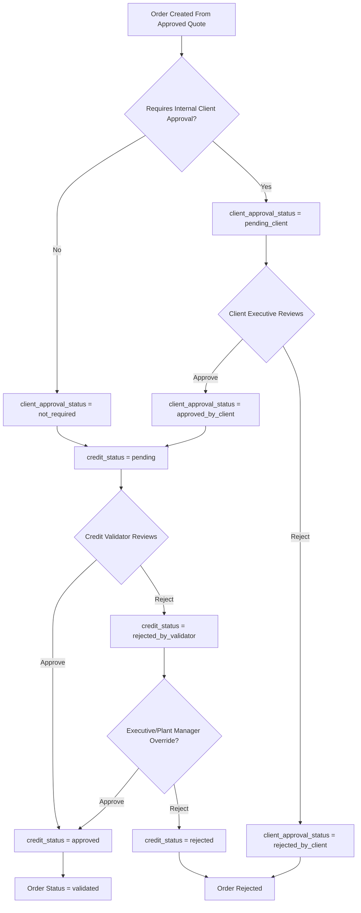
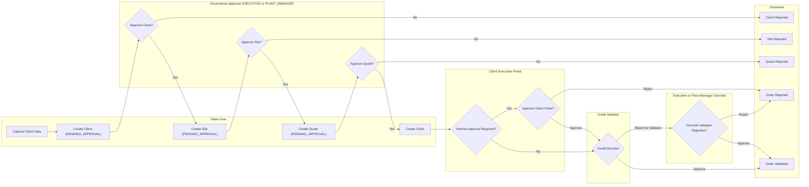

# Process Baseline And Flow Diagrams

## Scope And Terminology

- `Crestin` is mapped to **construction site creation** (`construction_site` / `obra`).
- The baseline covers: client creation, required information, credit information, construction site flow, approval flow, and quotation flow.

## Actors And Roles

- **Sales User**: creates clients, sites, and quotes.
- **Governance Approver** (`EXECUTIVE`, `PLANT_MANAGER`, or `CREDIT_VALIDATOR`): approves/rejects clients and construction sites.
- **Quote Approver** (`EXECUTIVE` or `PLANT_MANAGER`): approves/rejects quotes.
- **Client Executive** (portal role `executive`): approves/rejects internal client orders when required.
- **Credit Validator** (`CREDIT_VALIDATOR`): validates order credit status and can authorize clients and construction sites.

## 1) Client Creation Process

1. Sales user captures client information.
2. System performs duplicate checks (business name and code/RFC context).
3. Client is created with `approval_status = PENDING_APPROVAL`.
4. Governance approver approves or rejects client.
5. Only approved clients continue to site creation, quotes, and orders.

### Client Information Needed

#### Required in all entry points

- `business_name`
- `phone`
- `client_code` (conditional behavior):
  - If `requires_invoice = true`, user provides RFC in `client_code`
  - If `requires_invoice = false`, cash-style code is generated/suggested

#### Entry-point difference

- Full page creation also validates `contact_name` as required.
- Modal creation does not require `contact_name`.

#### Optional fields (common)

- `email`, `address`, `rfc` (cash clients may omit), `credit_status` and others depending on form.

## 2) Construction Site Creation Process

1. User requests site creation for a client.
2. System validates client exists and has `approval_status = APPROVED`.
3. Site is created with site data (`name` required; location/access/special conditions optional).
4. Site follows governance approval lifecycle (`PENDING_APPROVAL -> APPROVED/REJECTED`).
5. Quote creation validates that selected site is approved.

## 3) Credit Information Process

1. Credit terms are created/updated for a client.
2. Terms status depends on role:
   - Sales roles create `pending_validation`
   - Executive/credit roles can create `active`
3. Credit validator can approve terms and activate them.
4. System keeps one active credit term per client by terminating prior active terms when new active terms are approved.
5. Order-level `credit_status` drives execution gating:
   - `pending`, `approved`, `rejected`, `rejected_by_validator`

### Core Credit Data

- `credit_limit`
- `status` (`draft`, `pending_validation`, `active`, `terminated`)
- `effective_date`
- Optional pagaré fields (`pagare_amount`, `pagare_expiry_date`)
- Payment policy fields (`payment_frequency_days`, `grace_period_days`)

## 4) Approval Process (Combined)

### A. Governance (Client/Site)

- Client/Site created in `PENDING_APPROVAL`.
- `EXECUTIVE`, `PLANT_MANAGER`, or `CREDIT_VALIDATOR` approves or rejects.

### B. Quote Approval

- New quotes start in `PENDING_APPROVAL` (manual approval required).
- `EXECUTIVE`/`PLANT_MANAGER` approves or rejects.

### C. Client Internal Approval (Orders)

- Orders can require client executive approval based on client/order context.
- Client executive cannot approve own order.
- Status path: `pending_client -> approved_by_client/rejected_by_client`.

### D. Credit Validation

- Orders reaching credit gate are validated by credit validator.
- Validator may approve or reject (`rejected_by_validator`).
- Executive/plant manager can override from `rejected_by_validator` to approved.

## 5) Quotation Process

1. Sales user creates quote with client, site, plant, and line details.
2. System validates site approval before quote creation.
3. System computes quote pricing context and assigns quote number.
4. Quote is stored with `status = PENDING_APPROVAL`.
5. Approver approves (`APPROVED`) or rejects (`REJECTED`).
6. Approved quote can be converted into order flow.

## Flow Nodes (For Diagram Consistency)

- `clientCreatedPending`
- `clientApproved`
- `siteCreatedPending`
- `siteApproved`
- `quoteCreatedPending`
- `quoteApproved`
- `orderCreated`
- `clientInternalDecision`
- `creditDecision`
- `orderValidated`
- `orderRejected`

## Diagram 1: High-Level Macro Flow

```mermaid
flowchart LR
    startNode["Start"] --> clientCreatedPending["Client Created (PENDING_APPROVAL)"]
    clientCreatedPending --> governanceClientDecision{"Governance Client Decision"}
    governanceClientDecision -->|Approve| clientApproved["Client Approved"]
    governanceClientDecision -->|Reject| clientRejected["Client Rejected"]

    clientApproved --> siteCreatedPending["Site Created (PENDING_APPROVAL)"]
    siteCreatedPending --> governanceSiteDecision{"Governance Site Decision"}
    governanceSiteDecision -->|Approve| siteApproved["Site Approved"]
    governanceSiteDecision -->|Reject| siteRejected["Site Rejected"]

    siteApproved --> quoteCreatedPending["Quote Created (PENDING_APPROVAL)"]
    quoteCreatedPending --> quoteDecision{"Quote Decision"}
    quoteDecision -->|Approve| quoteApproved["Quote Approved"]
    quoteDecision -->|Reject| quoteRejected["Quote Rejected"]

    quoteApproved --> orderCreated["Order Created"]
    orderCreated --> clientInternalDecision{"Client Internal Approval Required?"}
    clientInternalDecision -->|No| creditDecision["Credit Validation"]
    clientInternalDecision -->|Yes| clientExecDecision{"Client Executive Decision"}
    clientExecDecision -->|Approve| creditDecision
    clientExecDecision -->|Reject| orderRejected["Order Rejected"]

    creditDecision --> creditOutcome{"Credit Decision"}
    creditOutcome -->|Approved| orderValidated["Order Validated"]
    creditOutcome -->|Rejected| orderRejected
```

## Diagram 2: Detailed Approval Decision Flow

## Diagram 3: Strict Swimlane Format (By Actor)

## Known Modeling Notes

- Two client creation entry points have different field strictness for `contact_name`.
- The codebase does not use the term `Crestin`; canonical technical term is `construction_site`.
- Credit checks are strongly represented in approval routing; quote creation itself is mainly gated by site approval.

## Obligatory Information At Creation Time (By Item)

### A) Client Creation (`clients`)

- Obligatory:
  - `business_name`
  - `phone`
  - `client_code`
- Conditional obligatory:
  - If `requires_invoice = true`, RFC must be provided in `client_code` (and mapped to `rfc`).
- Entry-point note:
  - Full page client creation also enforces `contact_name`.
  - Modal client creation allows empty `contact_name`.

### B) Construction Site Creation (`construction_sites`)

- Obligatory:
  - `client_id` (must exist and have `approval_status = APPROVED`)
  - `name` (site name)
- Optional at creation:
  - `location`, `access_restrictions`, `special_conditions`, `is_active`, `latitude`, `longitude`

### C) Credit Terms Creation (`client_credit_terms`)

- Obligatory context:
  - `client_id` (path parameter in API)
  - Authenticated user with role allowed by endpoint/policy
- Obligatory payload rule in API:
  - At least one of `credit_limit` or `notes` must be provided.
- UI quick-setup stricter rule (current behavior):
  - `credit_limit` (> 0)
  - `payment_instrument_type`
- Optional:
  - `effective_date`, pagaré fields, frequency/grace fields (depending on role)

### D) Quote Creation (`quotes`)

- Obligatory in create contract:
  - `client_id`
  - `construction_site`
  - `location`
  - `validity_date`
  - `plant_id`
  - `details` (array in request contract)
- Obligatory business gate:
  - If `construction_site_id` is present, referenced site must be `APPROVED`.
- System-set on creation:
  - `status = PENDING_APPROVAL` (manual approval flow)

### E) Order Creation (`orders`)

- Obligatory in `OrderCreationParams` contract:
  - `quote_id`
  - `client_id`
  - `construction_site`
  - `delivery_date`
  - `delivery_time`
  - `requires_invoice`
  - `special_requirements` (nullable, but key is present in contract)
  - `total_amount`
  - `order_status`
  - `credit_status`
- Obligatory runtime gate:
  - Authenticated user is required to create orders.
