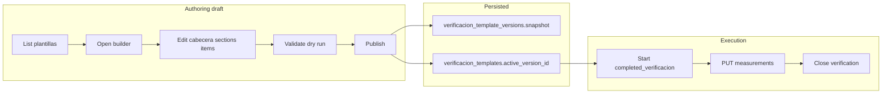

# EMA Plantillas — Lifecycle map (authoring → publish → execution)

This document maps the end-to-end lifecycle for **plantillas de verificación** (verification templates) in the EMA module: UI entry points, API routes, shared libraries, and database tables. It is the implementation artifact for the **lifecycle-map** audit todo.

## Domain vocabulary

| Concept | DB / API | Notes |
|--------|----------|--------|
| Conjunto (tool set) | `conjuntos_herramientas` | Owns one or more plantillas for verification conjuntos. |
| Plantilla (template) | `verificacion_templates` | Draft or published; `active_version_id` points at current published snapshot. |
| Sección | `verificacion_template_sections` | `layout`, `instances_config`, `series_config`, repetitions. |
| Punto (item) | `verificacion_template_items` | `punto`, `tipo`, `variable_name`, `formula`, `pass_fail_rule`, `contributes_to_cumple`, … |
| Cabecera / datos iniciales | `verificacion_template_header_fields` | `field_key`, `label`, `source`, `variable_name`, `formula`. |
| Versión publicada | `verificacion_template_versions` | Immutable `snapshot` JSON. |
| Verificación completada | `completed_verificaciones` + `completed_verificacion_measurements` | Bound to `template_version_id`. |

## User-facing pages (App Router)

| Step | Route | Role |
|------|-------|------|
| Índice global | `src/app/quality/plantillas/page.tsx` | Lists plantillas (`GET /api/ema/plantillas`). |
| Conjunto → plantilla | `src/app/quality/conjuntos/[id]/plantilla/page.tsx` | Builder: cabecera, secciones, puntos, preview (`TemplateFicha`), validate, publish. Query `?template=` when multiple templates. |
| Conjunto tab | `src/app/quality/conjuntos/[id]/page.tsx` | Links into plantilla editor. |
| Ejecutar verificación | `src/app/quality/instrumentos/[id]/verificar/page.tsx` | Loads snapshot; datos de cabecera; steps; saves measurements + optional `header_values`. |
| Verificación cerrada | `src/app/quality/instrumentos/[id]/verificaciones/[verifId]/page.tsx` | Read-only view of saved measurements. |

## API routes (draft CRUD)

| Method | Path | Purpose |
|--------|------|---------|
| GET | `/api/ema/plantillas` | Global catalog. |
| GET/POST | `/api/ema/conjuntos/[id]/templates` | List / create draft template. |
| GET | `/api/ema/templates/count` | Next `DC-LC-6.4-NN` code helper. |
| GET/PATCH | `/api/ema/templates/[id]` | Template metadata + merged `header_fields` + sections/items. |
| POST | `/api/ema/templates/[id]/header-fields` | Add cabecera row. |
| POST | `/api/ema/templates/[id]/sections` | Create section. |
| PATCH/DELETE | `/api/ema/templates/[id]/sections/[sid]` | Update/delete section. |
| POST | `/api/ema/templates/[id]/sections/[sid]/items` | Create item. |
| PATCH/DELETE | `/api/ema/templates/[id]/sections/[sid]/items/[iid]` | Update/delete item. |
| POST | `/api/ema/templates/[id]/validate` | Dry-run `validateTemplateForPublish`. |
| POST | `/api/ema/templates/[id]/publish` | Snapshot → `verificacion_template_versions`, set `active_version_id`, `estado`. |
| POST | `/api/ema/templates/[id]/evaluate-preview` | Evaluate `{ expr, scope }` (tooling; not wired in main builder UI). |

## API routes (execution)

| Method | Path | Purpose |
|--------|------|---------|
| POST | `/api/ema/instrumentos/[id]/verificaciones` | Start run: picks template/version; may return `PLANTILLA_REQUIRED` if multiple published. |
| GET | `/api/ema/template-versions/[id]` | Load published snapshot; may merge `header_fields` if missing from JSON. |
| PUT | `/api/ema/verificaciones/[id]/measurements` | Upsert rows; builds `headerScope` from `header_values`; computes `cumple` via `measurementCompute`. |
| POST (etc.) | `/api/ema/verificaciones/[id]/close` | Close verification, set `resultado`, next date, etc. |

## Shared libraries

| Module | Path | Role |
|--------|------|------|
| Types | `src/types/ema.ts` | `VerificacionTemplate*`, snapshot shape, `PassFailRule`, header field types. |
| Publish validation | `src/lib/ema/templateValidate.ts` | `validateTemplateForPublish` — duplicate `variable_name` per section, derivado DAG, contributing items without rules. |
| Item normalization | `src/lib/ema/templateItem.ts` | Legacy → v2 `item_role`, `primitive`, `pass_fail_rule`, slug fallback for `variable_name`. |
| Formulas | `src/lib/ema/formula.ts` | `parseFormula`, `evaluateFormula`, `validateDerivadoDAG`, `extractVariables`. |
| Layout | `src/lib/ema/sectionLayout.ts` | `effectiveLayout`, `effectiveSectionRepetitions`, `referencePointForRow`. |
| Pass/fail | `src/lib/ema/passFail.ts` | `evaluatePassFailRule` (tolerance, range, bool, expression, formula_bound). |
| Row build | `src/lib/ema/measurementCompute.ts` | `buildRowsForMeasurementPut`, derivado evaluation, scope from inputs + header. |
| Preview | `src/components/ema/TemplateFicha.tsx` | Excel-style ficha preview in builder dialog. |

## Database tables (public schema)

Primary:

- `verificacion_templates`
- `verificacion_template_sections`
- `verificacion_template_items`
- `verificacion_template_header_fields`
- `verificacion_template_versions`
- `completed_verificaciones`
- `completed_verificacion_measurements`

Related EMA context: `conjuntos_herramientas`, `instrumentos`, `programa_calibraciones`, `ema_configuracion` (see `src/types/database.types.generated.ts`).

## Lifecycle sequence (mermaid)

## Multi-template and versioning

- A conjunto may have **multiple** `verificacion_templates`. Builder and start-verification flows may require picking `template_id` when more than one published template exists.
- **Publish** creates a new row in `verificacion_template_versions` and bumps `version_number`. Existing `completed_verificaciones` rows keep their `template_version_id` (historical immutability at the run level).
- **Snapshot** today includes `template` + `sections` (+ nested items). Header fields may be merged at read time if absent from JSON (see measurements route and template-version route).

## Documentation cross-links

- v2 behavior summary: [EMA_PLANTILLAS_V2.md](../EMA_PLANTILLAS_V2.md)
- UX redesign proposal: [ema-plantillas-ux-redesign-proposal.md](../plans/ema-plantillas-ux-redesign-proposal.md)
